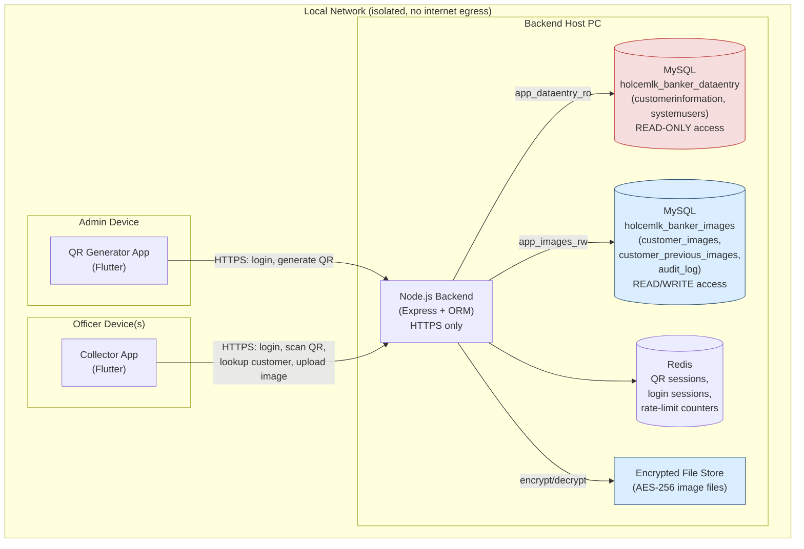

# System Architecture Diagram
## HolcemLK Banker Customer Signature & Image Collection System

Logical component architecture — all traffic confined to the local network, TLS-encrypted end to end.

### Architecture Notes
- **Two isolated credential paths** into the databases — `app_dataentry_ro` cannot write, `app_images_rw` cannot touch `customerinformation`/`systemusers`.
- **Redis** exists purely for ephemeral state (QR one-time-use tracking, concurrent-login session pointer, rate-limit counters) — not a system of record.
- **Encrypted File Store** holds the actual AES-256 encrypted image binaries; `customer_images`/`customer_previous_images` tables hold only paths + hashes (per the earlier design decision to avoid LONGBLOB).
- No component in this diagram has an inbound connection from outside the LAN — router-level port forwarding/UPnP must remain disabled (see Configuration Document, Phase 6).
