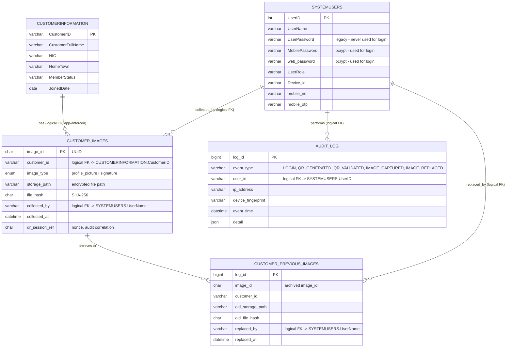
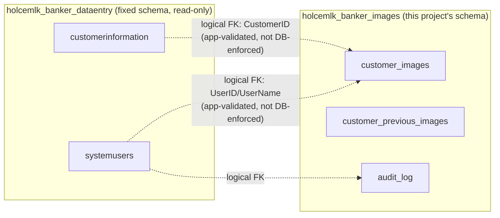

# Entity Relationship (ER) Diagram
## HolcemLK Banker Customer Signature & Image Collection System

Entities span two databases. Relationships crossing the `holcemlk_banker_dataentry` ↔ `holcemlk_banker_images` boundary are **logical only** (application-enforced) — there is no DB-level foreign key across separate database schemas/credentials, by design (least-privilege isolation).

### Cross-Database Boundary

