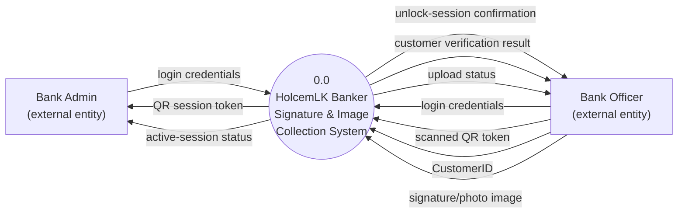
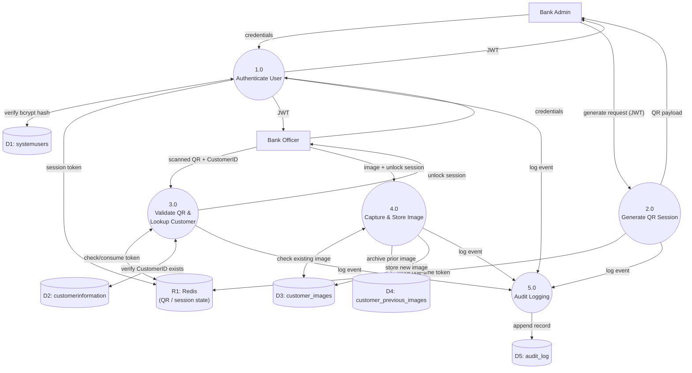

# Data Flow Diagrams — DFD Level 0 (Context) & Level 1
## HolcemLK Banker Customer Signature & Image Collection System

## DFD Level 0 (Context Diagram)
Single process representing the whole system, showing external entities only.

## DFD Level 1 (Process Decomposition)
Breaks the single Level-0 process into its core functional processes and data stores.

### Process Descriptions
| Process | Description | Reads | Writes |
|---|---|---|---|
| 1.0 Authenticate User | Verifies bcrypt-hashed credentials, issues JWT, handles OTP step-up and concurrent-login control | D1 (systemusers) | R1 (session pointer) |
| 2.0 Generate QR Session | Admin-only; creates signed, one-time, 15-min QR token | — | R1 (qr:{nonce}) |
| 3.0 Validate QR & Lookup Customer | Consumes QR token, issues unlock session, verifies CustomerID | R1, D2 (customerinformation) | R1 (mark consumed) |
| 4.0 Capture & Store Image | Encrypts, watermarks, archives-then-inserts image | D3 | D3, D4 |
| 5.0 Audit Logging | Append-only logging of every event across all processes | — | D5 (audit_log) |
