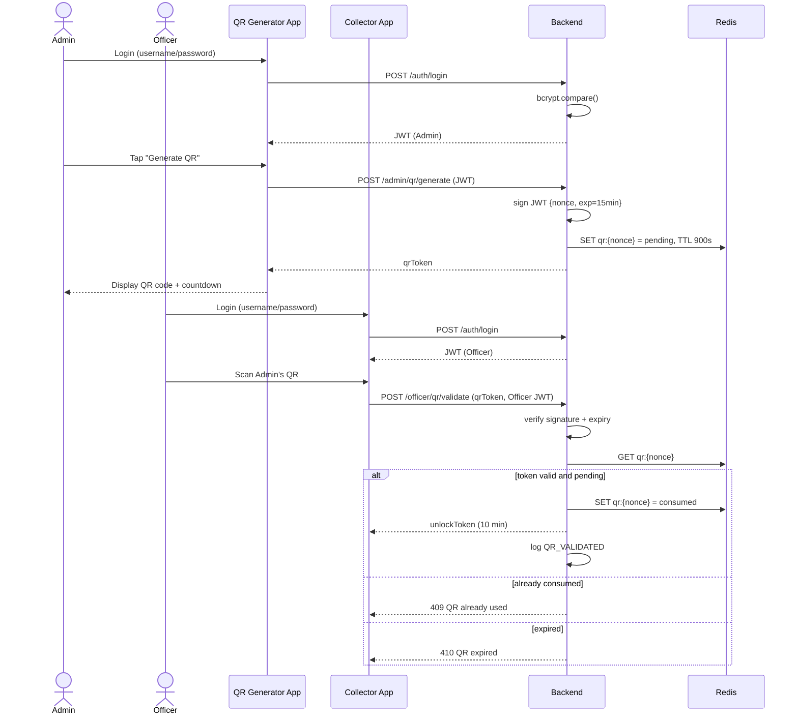
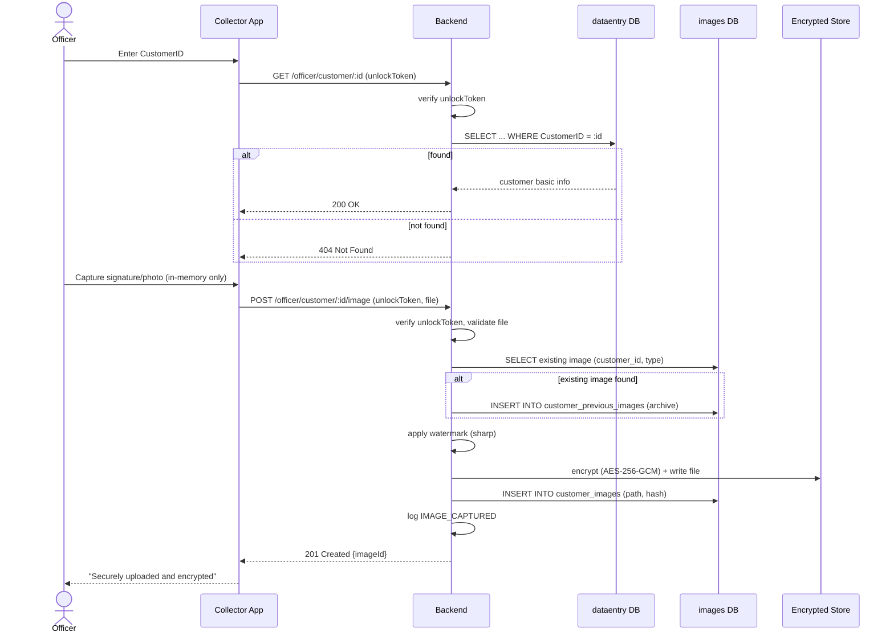

# Sequence Diagrams
## HolcemLK Banker Customer Signature & Image Collection System

*(Not explicitly requested, but a standard System Design artifact — added to make the QR flow and upload flow from the LLD unambiguous for developers implementing them.)*

## 1. QR Generation & Validation Flow

## 2. Image Capture & Upload Flow

