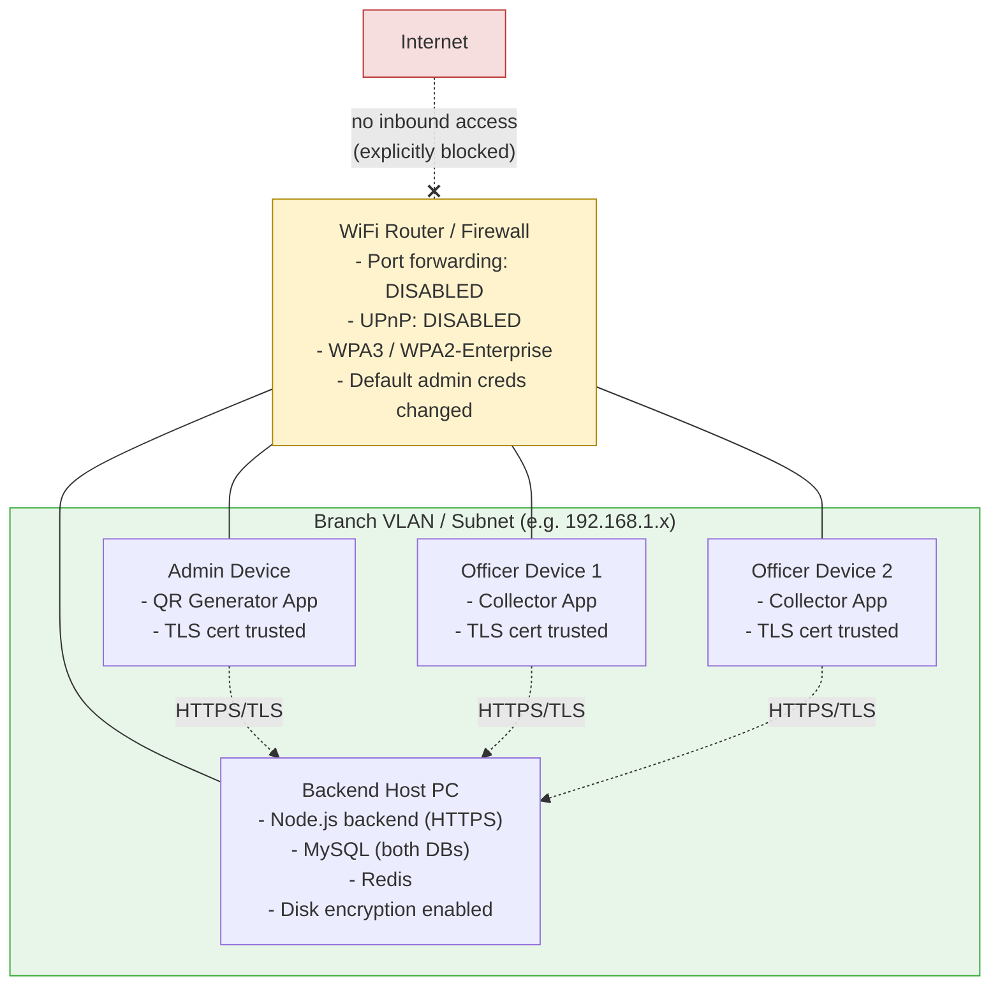

# Deployment / Network Diagram
## HolcemLK Banker Customer Signature & Image Collection System

*(Not explicitly requested, but a standard System Design artifact — added because the architecture depends heavily on physical LAN topology and VLAN isolation, which deserves its own diagram separate from the logical component diagram.)*

### Notes
- If the router supports VLANs, all four devices sit on one isolated branch VLAN, separate from any guest/other office traffic.
- If VLANs are not supported, the compensating controls from the SRS/Configuration Document apply instead: OTP step-up on new device/IP, concurrent-login lockout, and audit-based anomaly alerts — **not** static IP/MAC binding (previously ruled out as impractical for officers using multiple devices).
- The Backend Host PC is the single point of physical security focus: disk encryption, OS auto-lock, and restricted physical access are mandatory since both databases and the encrypted image store live there.
